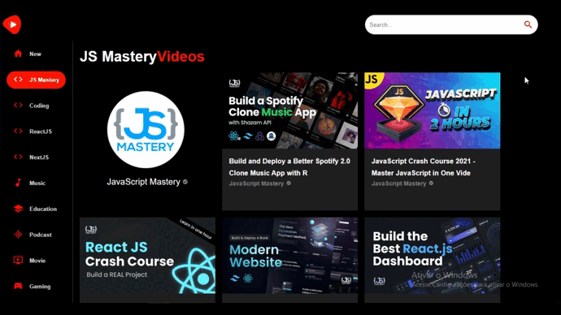

# Youtube Clone

## | About

In this project I've used MaterialUI for the first time and some new features. I've learned a lot doing it.

# PC Version

## | Home Page

## | Video

## | Search Bar

## | Channel Details

# Mobile Version

## | Home Page

## | Video

## | Search Bar

## | Channel Details

## | Done Using
<ul>
    <li>ReactJS</li>
    <li>Typescript</li>
    <li>MaterialUI</li>
    <li>Axios</li>
    <li>API</li>
    <li>React-Router</li>
</ul>

## | How to Run

Make sure "Git" is installed in your PC!

    git clone https://github.com/Bruno-Messias-B-S/Youtube-Clone.git

### To Install
    npm install

### To Run
    npm run dev

## | Made By
[Bruno Messias](https://www.linkedin.com/in/bruno-messias-bs/)
